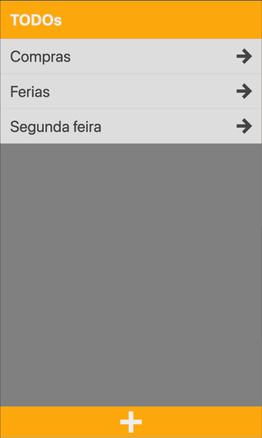
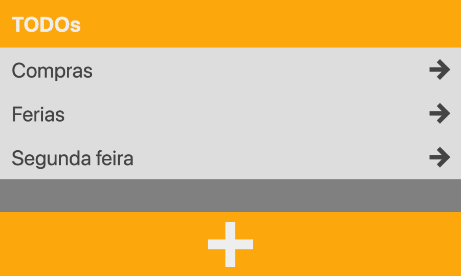

Sure, here is the entire `README.md` content in markdown format:

```markdown
# TODOs - Progressive Web Application (PWA)

## Overview

TODOs is a Progressive Web Application (PWA) that allows users to manage tasks efficiently. It supports offline functionality using a service worker and local storage. The application is built with custom web components and follows modern web standards.

## Features

- Add, update, and delete tasks and items.
- Offline support using Service Worker.
- Responsive design.
- Intuitive user interface with custom web components.

## Project Structure
```

|-- index.html
|-- manifest.json
|-- script.js
|-- serviceWorker.js
|-- style.css
|-- system.css
|-- TodoModel.js
|-- webComponents.js
|-- images
| |-- icon.svg
| |-- icon-192.svg
| |-- icon-512.svg
| |-- screenshot1.png
| |-- screenshot2.png

````

## Files Description

### index.html
The main HTML file that sets up the structure of the application.

### manifest.json
The web app manifest file that provides metadata for the PWA. It includes information like name, icons, start URL, and theme color.

### script.js
The main JavaScript file that initializes the application, registers the service worker, and manages the interaction between the user interface and the `TodoModel`.

### serviceWorker.js
A service worker script that caches essential files for offline access and handles fetch requests.

### style.css
The main stylesheet for the application, which includes general styles and imports `system.css` for variables.

### system.css
A CSS file that defines global variables for colors, padding, margins, and transitions.

### TodoModel.js
A JavaScript module that manages the tasks and items, handles local storage operations, and provides methods to manipulate tasks and items.

### webComponents.js
A JavaScript file that defines custom web components (`todo-header`, `task-item`, `check-item`, and `todo-dialog`) used in the application.

## Installation

1. Clone the repository:
   ```sh
   git clone https://github.com/your-username/todos-pwa.git
   cd todos-pwa
````

2. Open `index.html` in a web browser.

## Usage

1. **Adding a Task**:

   - Click the "+" button at the bottom.
   - Enter the task name and press Enter or click the confirm button.

2. **Adding an Item to a Task**:

   - Click on a task to open it.
   - Click the "+" button at the bottom.
   - Enter the item name and press Enter or click the confirm button.

3. **Marking an Item as Completed**:

   - Click the checkbox next to an item to mark it as completed.

4. **Deleting a Task or Item**:
   - Swipe the task or item to the left to reveal the delete button.

## Service Worker

The service worker is responsible for caching the application files and serving them when the network is unavailable. It caches the following files:

- index.html
- style.css
- system.css
- script.js
- webComponents.js
- TodoModel.js
- manifest.json
- Icons and screenshots

## Custom Web Components

### `<todo-header>`

A custom element representing the header of the TODO application.

### `<task-item>`

A custom element representing a task item in the list.

### `<check-item>`

A custom element representing a checkable item within a task.

### `<todo-dialog>`

A custom element representing a dialog box for adding tasks or items.

## Screenshots




## License

This project is licensed under the MIT License.

```

Feel free to copy and paste the above markdown content into your `README.md` file.
```
